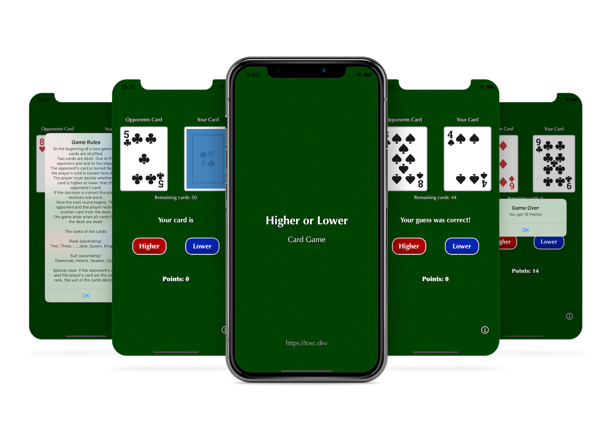

#  Higher or Lower Card Game

A card game for iPhone where you have to guess whether your card is higher or lower than the opponent's card.  
Made with Swift and UIKit.

## Game instructions

At the beginning of a new game the cards are shuffled.  
Two cards are dealt. One to the opponent and one to the player.  
The opponent's card is turned face up, the player's card is turned face down.  
The player must decide whether his card is higher or lower than the opponent's card.  
If the decision is correct the player receives one point.  
Now the next round begins. The opponent and the player receive another card from the deck.  
The game ends when all cards from the deck are dealt.  
  
The ranks of the cards:  
  
Rank (ascending):  
Two, Three, ..., Jack, Queen, King, Ace  
  
Suit (ascending):  
Diamonds, Hearts, Spades, Clubs  
  
Special case: If the opponent's card and the player's card are the same rank, the suit of the cards decides.

## License

Distributed under the MIT License. See `LICENSE` for more information.

## Acknowledgements

The card images are from 'Boardgame Pack' made by Kenney.  
Boardgame Pack is licensed under the CC0 1.0 Universal license.  
https://kenney.nl/assets/boardgame-pack  
  
The app presentation mock-up is made by Reza Azmy.  
https://www.behance.net/gallery/61503231/Phone-X-App-Presentation-Mock-Up  
